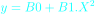
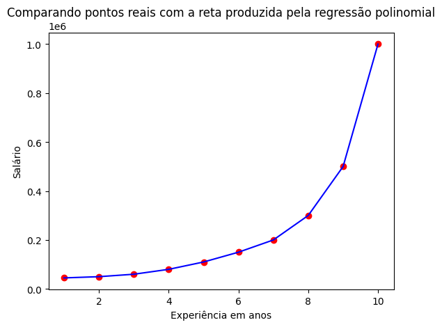
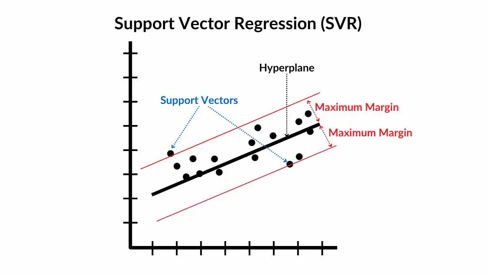
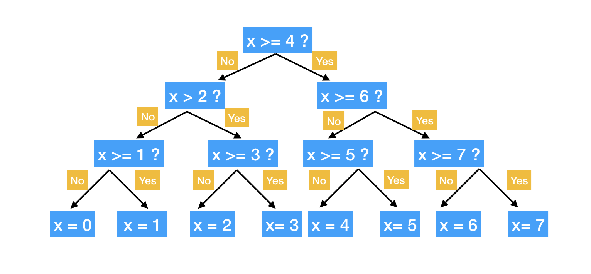
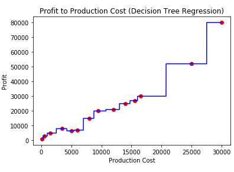
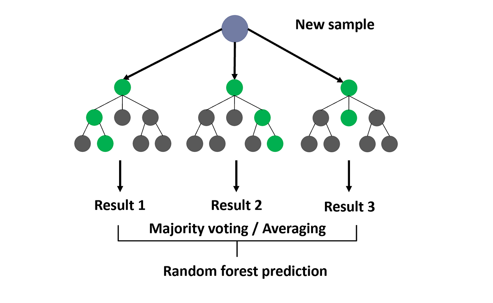
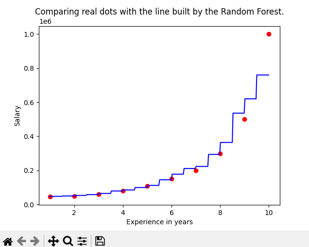
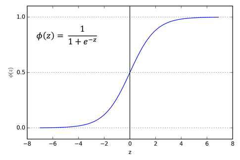

# Basic concepts:
### Classification and regression
**Classification** is a supervised learning task where the goal is to predict a category or class label for each input based on the given data. In classification, the target variable (also called the dependent variable or output) consists of discrete labels or categories.
 * Problem type: Discrete outcomes (categories or classes).
 * Target variable: Categorical (e.g., labels such as "Yes" or "No", "Cat" or "Dog", etc.).
 * Output: A class or category label (often represented as a number or text).
 * Examples of Classification:
    * Spam detection: Classifying emails as "Spam" or "Not Spam".
    * Image recognition: Identifying whether an image contains a "Cat", "Dog", or "Bird".
    * Medical diagnosis: Predicting whether a patient has a "Disease" or "No Disease" based on medical tests.
    * Credit scoring: Classifying a person as "High Risk" or "Low Risk" based on financial data.
 * Common Classification Algorithms:
    * Logistic Regression
    * Decision Trees
    * Support Vector Machines (SVM)
    * Random Forest
    * K-Nearest Neighbors (KNN)
    * Neural Networks (e.g., CNN for image classification)

**Regression** is another supervised learning task where the goal is to predict a continuous numerical value based on input data. In regression, the target variable is continuous, meaning it can take any real number within a range.
 * Problem type: Continuous outcomes (numeric values).
 * Target variable: Numerical (e.g., predicting house prices, temperature, stock prices).
 * Output: A continuous numerical value (e.g., a price, temperature, etc.).
 * Examples of Regression:
    * House price prediction: Predicting the price of a house based on features such as size, location, and the number of rooms.
    * Stock price prediction: Predicting the future price of a stock.
    * Temperature prediction: Predicting the temperature for the next day based on historical weather data.
    * Sales forecasting: Predicting future sales based on past sales data.
* Common Regression Algorithms:
    * Linear Regression
    * Decision Trees
    * Random Forest
    * Support Vector Regression (SVR)
    * Neural Networks (e.g., deep learning for regression tasks)

**Summary table**

| **Aspect**            | **Classification**                          | **Regression**                           |
|-----------------------|---------------------------------------------|------------------------------------------|
| **Target Variable**   | Categorical (discrete classes)              | Continuous (real values)                 |
| **Output**            | A class label (e.g., "Yes" or "No")         | A real number (e.g., 25.5, 300, etc.)    |
| **Example Problem**   | Spam detection, Disease diagnosis          | Price prediction, Temperature forecast   |
| **Evaluation Metrics**| Accuracy, Precision, Recall, F1-score      | Mean Absolute Error (MAE), Mean Squared Error (MSE), R-squared |
| **Output Type**       | Category (Class label)                     | Real number (numeric)                   |


### Categorial variables and numerical variables
**1. Categorical Variables (Qualitative Data)**
</br>
Categorical variables represent categories or labels. They are used to describe characteristics that can be grouped into distinct categories, where each category represents a different value. These values typically do not have a meaningful order or ranking.
 * Examples:
    * Gender: Male, Female
    * Country: USA, Canada, Germany, Japan
    * Color: Red, Blue, Green
    * Product type: Electronics, Clothing, Food
    * Marital status: Single, Married, Divorced
    * Types of Categorical Variables:
    * Nominal: Categories with no inherent order (e.g., color, country, or product type). No ranking is possible.
    * Ordinal: Categories with a meaningful order or ranking, but the distances between categories are not meaningful (e.g., education level: High School, Bachelor's, Master's, PhD; or satisfaction level: Poor, Average, Good).

**2. Numerical Variables (Quantitative Data)**
</br>
Numerical variables represent quantities and are measured in terms of numbers. They can be further divided into two types based on whether the values are discrete or continuous:

**Types of Numerical Variables:**
Discrete: These are countable values, often integers, that represent whole numbers. Discrete variables typically arise from counting something (e.g., number of children, number of products sold).
 * Examples:
    * Number of students in a class
    * Number of cars in a parking lot
    * Number of goals scored in a game

Continuous: These are values that can take any real number within a range. Continuous variables arise from measurements and can have infinite possible values between any two values.
 * Examples:
    * Height (e.g., 5.8 feet, 6.2 feet)
    * Weight (e.g., 150.5 pounds, 200.1 pounds)
    * Temperature (e.g., 32.5°C, 100.2°C)

**Pre processing**
# Understanding `fit`, `transform`, and Their Differences in Scikit-learn

In Scikit-learn, the terms **`fit()`** and **`transform()`** are often used when working with data preprocessing and model training. These methods are integral in the process of preparing data and training machine learning models. Below, we will explain these methods in the context of several common classes used in Scikit-learn, specifically `LabelEncoder`, `StandardScaler`, and `SimpleImputer`.

## 1. What is `fit()`?

- **Definition**: The `fit()` method is used to compute the necessary statistics or parameters needed for a transformation. It **learns** from the input data and adapts the model to it.
  
- **In Context of Preprocessing**:
  - **`LabelEncoder`**: When you call `fit()`, the `LabelEncoder` will find all the unique labels in the target data and build a mapping of each unique label to a corresponding integer. For example, if the labels are `['cat', 'dog', 'cat']`, `fit()` will learn that `cat` maps to 0 and `dog` maps to 1.
  - **`StandardScaler`**: The `fit()` method calculates the mean and standard deviation for each feature (column). These statistics will be used later to scale the data.
  - **`SimpleImputer`**: The `fit()` method computes the statistics required for imputation (e.g., the mean or median for numerical data) based on the non-missing values in each column. These statistics will be used to replace missing values.

- **In Context of Training the Model**:
  - For models like **Logistic Regression** or **Random Forest**, calling `fit()` on the model will train the model by learning the relationship between the features (X) and the target (y). The model adjusts its parameters (like weights or trees) to minimize the error on the training data.

## 2. What is `transform()`?

- **Definition**: The `transform()` method is used to apply the learned statistics or parameters (computed by `fit()`) to **transform the input data** into a new representation or format.

- **In Context of Preprocessing**:
  - **`LabelEncoder`**: After `fit()` has been applied, `transform()` will use the learned label-to-integer mapping to convert categorical labels into numerical values. For example, `['cat', 'dog', 'cat']` would be transformed into `[0, 1, 0]` based on the previously learned mapping.
  - **`StandardScaler`**: After calculating the mean and standard deviation during `fit()`, the `transform()` method standardizes the features by subtracting the mean and dividing by the standard deviation. This scales the data to have a mean of 0 and a standard deviation of 1.
  - **`SimpleImputer`**: After learning the statistics during `fit()`, `transform()` will replace the missing values in the data with the computed mean (or other strategy like median or mode) for each column.

- **In Context of Training the Model**:
  - After calling `fit()`, many machine learning models (e.g., **Logistic Regression**, **Support Vector Machines**) require you to call `predict()` to generate predictions on new data, but they don't require `transform()`. However, when using transformers like `StandardScaler` or `SimpleImputer`, calling `transform()` on new, unseen data applies the same transformations that were learned from the training set to the test data, ensuring consistency across the training and testing phases.

## 3. The Difference Between `fit()` and `transform()`

- **`fit()`** is used to learn or compute statistics from the data (e.g., mean, variance, unique labels).
- **`transform()`** is used to actually modify the data based on the learned statistics (e.g., encode labels, scale features, or impute missing values).

### In Detail:
- **`fit()`** adapts a model or transformer to the data by learning necessary parameters, while **`transform()`** uses those parameters to convert or process the data.
- **In practice**, you would use `fit()` once on the training data to learn the parameters (e.g., label mapping, scaling factors), then use `transform()` to apply those learned parameters to both the training and test data.

## 4. Example Code with `LabelEncoder`, `StandardScaler`, and `SimpleImputer`

```python
from sklearn.preprocessing import LabelEncoder, StandardScaler
from sklearn.impute import SimpleImputer
from sklearn.model_selection import train_test_split
import numpy as np
import pandas as pd

# Example data
X = pd.DataFrame({
    'feature1': [1.2, np.nan, 3.4, 2.5, np.nan],
    'feature2': [5.6, 7.8, 9.0, np.nan, 6.3]
})
y = pd.Series(['cat', 'dog', 'cat', 'dog', 'cat'])

# 1. Label Encoding: Convert categorical labels to numeric
label_encoder = LabelEncoder()
y_encoded = label_encoder.fit_transform(y)  # fit() learns the unique labels; transform() converts them to integers

# 2. Handle Missing Values with SimpleImputer
imputer = SimpleImputer(strategy='mean')
X_imputed = imputer.fit_transform(X)  # fit() calculates the mean for imputation; transform() applies it to X

# 3. Standardize Features using StandardScaler
scaler = StandardScaler()
X_scaled = scaler.fit_transform(X_imputed)  # fit() computes mean and std; transform() scales the data

# Final processed data
print("Encoded Labels:", y_encoded)
print("\nImputed and Scaled Features:\n", X_scaled)
```

**Summary: **
 * fit() in LabelEncoder learns the unique labels and prepares the transformation.
 * fit() in SimpleImputer computes the mean of the features to replace missing values.
 * fit() in StandardScaler computes the mean and standard deviation for each feature.
 * transform() applies these learned transformations to the data to convert labels to integers, impute missing values, and scale features.

**Common use cases of transform:**
 - Scaling: In the case of feature scaling (e.g., using `StandardScaler`), transform applies the scaling formula (using the mean and standard deviation learned during fit) to the data.
 - Encoding: For categorical encoding (e.g., using `OneHotEncoder`), transform converts the input features into the encoded format based on the learned mapping.
 - Dimensionality Reduction: In algorithms like PCA (Principal Component Analysis), transform reduces the dimensions of the data using the principal components learned during fit.
 
### One-hot encoder concept
**One-hot encoding** is a technique used in machine learning to convert categorical variables into numerical variables that can be processed by machine learning algorithms. It works by creating a new binary feature for each category in the categorical variable. For example, if we have a categorical variable with three categories A, B, and C, the one-hot encoded version would be a binary vector [1, 0, 0] for category A, [0, 1, 0] for category B, and [0, 0, 1] for category C.
The dummy variable trap is a situation that occurs when using dummy variables (also known as one-hot encoding) in regression models, which leads to multicollinearity. This can cause problems when trying to interpret or train a machine learning model, particularly in linear regression models.

For example, consider a feature `Color` with three categories: Red, Blue, and Green. Using one-hot encoding, we can represent this feature with three new columns:
 * Color_Red
 * Color_Blue
 * Color_Green

The values for each row would be 1 or 0, depending on which category the data point belongs to.

**What Causes the Dummy Variable Trap?**

The dummy variable trap happens when you include all the dummy variables for a categorical feature in the regression model. This leads to perfect multicollinearity because one of the dummy variables can be perfectly predicted from the others. In other words, there is redundancy in the data.

For example, in the Color example above, if you include all three dummy variables (Color_Red, Color_Blue, and Color_Green), you don't need all of them because knowing two of the dummy variables is enough to determine the third one.

 * If `Color_Red = 1` and `Color_Blue = 0`, you know the color must be <span style="color: red; font-weight: bold;">Red</span>.
 * If `Color_Red = 0` and `Color_Blue = 1`, you know the color must be <span style="color: blue; font-weight: bold;">Blue</span>.
 * If `Color_Red = 0` and `Color_Blue = 0`, the color must be <span style="color: green; font-weight: bold;">Green</span>.

Since the third variable (Color_Green) can be inferred from the others, it's unnecessary to include it in the model.

Why is it a Problem?
When all dummy variables are included in a regression model, it introduces multicollinearity—a situation where two or more predictor variables are highly correlated. This violates the assumption of independence between the predictors, leading to:

Instability in the model: The model may produce unreliable or biased estimates for the coefficients of the features.
Inflated variance: It becomes harder to assess the significance of each predictor variable, as the effect of one predictor may be mixed with that of others.
### Lesson 4 - Linear Regression
**Linear regression** is a statistical method used for modeling the relationship between one or more independent variables (also called features or predictors) and a dependent variable (also called the target or response variable) by fitting a linear equation to observed data. It is one of the simplest and most widely used algorithms in machine learning and statistics for predictive modeling.
</br>
**Formula: F(x) = ax+b**
```python
from sklearn.linear_model import LinearRegression
import numpy as np
# Example data: Predict y based on x
X = np.array([[10], [22], [34], [46], [58]])  # Independent variable (feature)
y = np.array([1, 2, 3, 4, 5])  # Dependent variable (target)
# Create a Linear Regression model
model = LinearRegression()
# Fit the model (train it on the data)
model.fit(X, y)
# Predict using the trained model
y_pred = model.predict(X)
# Output the coefficients
print("Intercept:", model.intercept_)
print("Coefficient:", model.coef_)
# Print predictions
print("Predicted values:", y_pred)
```
**Example of linear regression graph**


### Lesson 5 - Multiple Linear Regression
**Multiple Linear Regression (MLR)** is an extension of simple linear regression that models the relationship between two or more independent variables (predictors) and a dependent variable (response). The goal of multiple linear regression is to predict the dependent variable using a linear combination of the independent variables.

The formula for Multiple Linear Regression is:
$$
Y = \beta_0 + \beta_1 X_1 + \beta_2 X_2 + \dots + \beta_n X_n + \epsilon
$$
```python
# Import necessary libraries
import numpy as np
import pandas as pd
import matplotlib.pyplot as plt
from sklearn.model_selection import train_test_split
from sklearn.linear_model import LinearRegression
from sklearn.metrics import mean_squared_error, r2_score
# Example data: House prices dataset
# Features: Number of rooms, Size (square feet)
# Target: House price in thousands of dollars
data = {
    'Rooms': [2, 3, 4, 5, 6, 7, 8, 9, 10, 11],
    'Size': [500, 600, 700, 800, 900, 1000, 1100, 1200, 1300, 1400],
    'Price': [150, 200, 250, 300, 350, 400, 450, 500, 550, 600]
}
# Convert data to DataFrame
df = pd.DataFrame(data)
# Define independent variables (X) and dependent variable (y)
X = df[['Rooms', 'Size']]  # Features
y = df['Price']  # Target
# Split data into training and testing sets
X_train, X_test, y_train, y_test = train_test_split(X, y, test_size=0.3, random_state=42)
# Initialize the Linear Regression model
model = LinearRegression()
# Train the model using training data
model.fit(X_train, y_train)
# Make predictions using the test set
y_pred = model.predict(X_test)
# Model coefficients and intercept
print("Model coefficients:", model.coef_)
print("Model intercept:", model.intercept_)
# Calculate Mean Squared Error and R-squared
mse = mean_squared_error(y_test, y_pred)
r2 = r2_score(y_test, y_pred)
print(f"Mean Squared Error (MSE): {mse}")
print(f"R-squared: {r2}")
# Plotting actual vs predicted values
plt.scatter(y_test, y_pred)
plt.xlabel('Actual Price')
plt.ylabel('Predicted Price')
plt.title('Actual vs Predicted House Prices')
plt.show()
```
### Lesson 6
**What is Backward Elimination?**

Backward elimination is a **feature selection technique** used in regression modeling to improve the model by systematically removing the least significant features (predictor variables). It’s a process to optimize the model by reducing its complexity, improving its interpretability, and sometimes enhancing its performance. The goal is to remove features that don't contribute meaningfully to predicting the dependent variable (target).

**Steps in Backward Elimination:**

1. Start with all features: You begin with all predictor variables in your model (i.e., all features are included).
2. Fit the model: You fit a regression model (such as Linear Regression) using all the features.
3. Check p-values: After fitting the model, you check the p-values of all the coefficients (parameters) associated with the features. These p-values represent the statistical significance of each feature in explaining the variability of the target variable.
4. Remove the least significant feature: If a feature has a high p-value (above a predetermined threshold), it suggests that this feature is not statistically significant in predicting the target. In this case, you remove that feature from the model.
5. Repeat the process: You fit the model again with the reduced set of features and repeat steps 3 and 4 until all remaining features have p-values lower than the threshold (usually 0.05).
6. Stop when all features are significant: The process stops when all remaining features have p-values below the significance level (threshold).

**What is a p-value?**

The p-value is a measure used in statistical hypothesis testing to determine whether a feature in a regression model is statistically significant.
 * A low p-value (typically less than 0.05) indicates that the feature is likely to be significant in explaining the target variable.
 * A high p-value suggests that the feature is not statistically significant and doesn't contribute meaningfully to the model. A common threshold for significance is 0.05, but this can vary depending on the context.

**What is Polynomial Regression?**

**Polynomial Regression** is an extension of linear regression that models the relationship between the independent variable and the dependent variable as an **n-th degree polynomial**. It is useful when the data shows a non-linear relationship.

**Formula:**

For a second-degree (quadratic) polynomial regression, the formula is:




Where \(X^n\) represents the \(n\)-th degree polynomial term. In practice, we often use **PolynomialFeatures** to transform the input features and fit the model accordingly.

**Example of polynomial regression graph:**


**Steps:**
1. Generate some data: We will simulate data that follows a quadratic relationship.
2. Transform the data to polynomial features: Using PolynomialFeatures from sklearn.preprocessing, we will transform the input data into polynomial features.
3. Fit a linear regression model: We will then use a linear regression model to fit the transformed data.
4. Visualize the results.

**Example of Polynomial Regression in Python (using Scikit-Learn):**

```python
from sklearn.preprocessing import PolynomialFeatures
from sklearn.linear_model import LinearRegression
import numpy as np
import matplotlib.pyplot as plt

# Sample data (quadratic relationship)
X = np.array([[1], [2], [3], [4], [5]])  # Independent variable
y = np.array([1, 4, 9, 16, 25])           # Dependent variable (y = x^2)

# Transform the data to include polynomial features
poly = PolynomialFeatures(degree=2)
X_poly = poly.fit_transform(X)

# Create and fit the model
model = LinearRegression()
model.fit(X_poly, y)

# Predicting
y_pred = model.predict(X_poly)

# Plotting the results
plt.scatter(X, y, color='blue', label='Original data')
plt.plot(X, y_pred, color='red', label='Polynomial fit')
plt.title('Polynomial Regression (Degree = 2)')
plt.xlabel('X')
plt.ylabel('y')
plt.legend()
plt.show()

# Output the coefficients
print("Intercept:", model.intercept_)
print("Coefficients:", model.coef_)
```

**Support vector regression(SVR)**

Support Vector Regression (SVR) is a machine learning algorithm used for regression tasks, where the goal is to predict a continuous(linear) value based on input data. It's part of the family of Support Vector Machines (SVM), which is typically known for its application in classification problems. However, SVR extends SVM concepts to regression, where instead of classifying data points into categories, we try to predict numerical values.

In typical regression, the goal is to find a function that best fits the data, minimizing the difference between the predicted values and the actual values (known as the error). For example, imagine you have data that represents the relationship between the years of experience and salary. The task is to predict someone's salary based on their years of experience.

In SVR, the algorithm aims to find a function (or curve) that fits the data while allowing some margin of error. This means SVR does not try to perfectly fit the data. Instead, it allows some errors, but only errors that fall outside a specified margin of tolerance (epsilon, ε). Errors within this margin are acceptable, and no penalty is applied.

**Key components of SVR:**
 * Epsilon(ε): This is the margin of error. The model tries to fit a line (or hyperplane) that predicts values within this margin. Any data points that fall within this margin are considered correct predictions, and no penalty is applied for them.
 * Support vectors: These are the data points that lie closest to the margin boundary. The support vectors are crucial because they define the boundary of the epsilon-tube and help the model determine the optimal function to use for prediction. These are the "most important" points, and the rest of the data points are not directly involved in defining the regression line or hyperplane.
 * Margin: This refers to the region around the predicted function where error is allowed. Points inside this margin do not contribute to the error, as long as their predicted value is within the epsilon-tube.

In its simplest form, SVR with a linear kernel tries to fit a straight line to the data. The objective is to find a line that fits most of the data points while allowing some points to lie outside the margin if needed.

**How does SVR works?**

In its simplest form, SVR with a linear kernel tries to fit a straight line to the data. The objective is to find a line that fits most of the data points while allowing some points to lie outside the margin if needed.

1. The model first selects a line (or hyperplane in higher dimensions) that approximates the target values.
2. Then, it defines a margin (or epsilon-tube) around this line. Any points that are inside this margin (i.e., have errors smaller than ε) are not penalized.
3. The remaining points that fall outside this margin are considered to have a large error and will influence the model’s parameters, aiming to reduce the error.

**Non-Linear Regression with Kernels:**

Sometimes, the relationship between the input features and the output variable is not linear. In such cases, SVR can use kernels to transform the data into a higher-dimensional space, where the relationship becomes linear.

 * Polynomial Kernel: Transforms the data into a higher-dimensional space using polynomial functions.
 * Radial Basis Function (RBF) Kernel: Uses a Gaussian function to map the data into a higher-dimensional space, where non-linear relationships can be better captured.

**Graph example:**
 

**Code example:**
```python
import numpy as np
import matplotlib.pyplot as plt
from sklearn.svm import SVR
from sklearn.preprocessing import StandardScaler
from sklearn.model_selection import train_test_split
from sklearn.metrics import mean_squared_error

# Step 1: Create a simple dataset
# Here, we'll use a simple quadratic relationship with some noise
X = np.random.uniform(1, 10, size=(100, 1))  # 100 random values between 1 and 10
y = np.sin(X).ravel() + np.random.normal(0, 0.1, X.shape[0])  # Sine function with noise

# Step 2: Split the data into training and test sets
X_train, X_test, y_train, y_test = train_test_split(X, y, test_size=0.2, random_state=42)

# Step 3: Scale the input data (SVR is sensitive to the scale of features)
sc_X = StandardScaler()
sc_y = StandardScaler()

X_train_scaled = sc_X.fit_transform(X_train)
X_test_scaled = sc_X.transform(X_test)

y_train_scaled = sc_y.fit_transform(y_train.reshape(-1, 1))
y_test_scaled = sc_y.transform(y_test.reshape(-1, 1))

# Step 4: Train the SVR model (using a linear kernel)
svr_model = SVR(kernel='linear', C=1e3)  # Linear kernel and a high penalty for error (C)
svr_model.fit(X_train_scaled, y_train_scaled.ravel())

# Step 5: Make predictions on the test set
y_pred_scaled = svr_model.predict(X_test_scaled)

# Step 6: Inverse transform to get the original scale for predictions and true values
y_pred = sc_y.inverse_transform(y_pred_scaled.reshape(-1, 1))
y_test = sc_y.inverse_transform(y_test_scaled)

# Step 7: Evaluate the model (using Mean Squared Error)
mse = mean_squared_error(y_test, y_pred)
print("Mean Squared Error (MSE):", mse)

# Step 8: Visualize the results
plt.figure(figsize=(10, 6))

# Plot the original data points
plt.scatter(X, y, color='gray', label='Original Data', alpha=0.5)

# Plot the SVR predictions (using the training set)
X_grid = np.linspace(min(X), max(X), 1000).reshape(-1, 1)  # High-resolution grid for smoother curve
y_grid_scaled = svr_model.predict(sc_X.transform(X_grid))
y_grid = sc_y.inverse_transform(y_grid_scaled.reshape(-1, 1))

plt.plot(X_grid, y_grid, color='red', label='SVR Prediction (Linear Kernel)', lw=2)

plt.title('Support Vector Regression with Linear Kernel')
plt.xlabel('Input Feature (X)')
plt.ylabel('Target Value (y)')
plt.legend()
plt.show()
```

**Decision tree**

A decision tree model is a supervised machine learning algorithm used for both classification and regression tasks. It models decisions and their possible consequences, including chance events, resource costs, and utility.

**Structure of a Decision Tree:**
 * Root Node: Represents the entire dataset and the first decision point.
 * Internal Nodes: Each internal node represents a decision based on a feature (variable), splitting the data into subsets.
 * Leaf Nodes: The terminal nodes that represent the final outcome or class label in classification or a continuous value in regression.
 * Branches: The edges connecting nodes, representing the outcome of a decision (split).

**Tree example:**
 
**Graph example:**
 

**Advantages of Decision Trees:**
 * Easy to Understand: The model is easy to interpret because it mimics human decision-making.
 * No Feature Scaling Needed: Decision trees do not require normalization or scaling of the data.
 * Can Handle Both Numerical and Categorical Data: It can handle both types of variables without the need for transformation.
 * Non-Linear Relationships: Can capture complex non-linear relationships between features and target.

**Disadvantages:**
 * Overfitting: Decision trees can easily overfit the training data, especially if the tree is deep. This happens when the tree becomes too complex and starts capturing noise in the data rather than general patterns.
 * Instability: Small changes in the data can result in a completely different structure for the tree.
 * Greedy Algorithm: The decision tree is a greedy algorithm, meaning it makes the optimal decision at each node without considering the global optimal structure, which can sometimes lead to suboptimal models.

**Code example:**
```python
# Import necessary libraries
import numpy as np
import matplotlib.pyplot as plt
from sklearn import datasets
from sklearn.tree import DecisionTreeClassifier, export_graphviz
from sklearn.model_selection import train_test_split

# Load the Iris dataset
iris = datasets.load_iris()
X = iris.data[:, :2]  # Using only the first two features for visualization (sepal length and sepal width)
y = iris.target

# Split the data into training and test sets
X_train, X_test, y_train, y_test = train_test_split(X, y, test_size=0.3, random_state=42)

# Create a Decision Tree classifier
clf = DecisionTreeClassifier(random_state=42)

# Train the classifier
clf.fit(X_train, y_train)

# Export the trained decision tree as a .dot file
export_graphviz(clf, out_file='tree.dot', feature_names=["Sepal Length", "Sepal Width"], class_names=iris.target_names)

# Create a mesh grid to plot decision boundaries
x_min, x_max = X[:, 0].min() - 1, X[:, 0].max() + 1
y_min, y_max = X[:, 1].min() - 1, X[:, 1].max() + 1
xx, yy = np.meshgrid(np.arange(x_min, x_max, 0.01),
                     np.arange(y_min, y_max, 0.01))

# Predict the class for each point in the mesh grid
Z = clf.predict(np.c_[xx.ravel(), yy.ravel()])
Z = Z.reshape(xx.shape)

# Plot the decision boundary
plt.contourf(xx, yy, Z, alpha=0.4)
plt.scatter(X[:, 0], X[:, 1], c=y, s=30, edgecolor='k')
plt.xlabel('Sepal Length')
plt.ylabel('Sepal Width')
plt.title('Decision Tree Classifier - Decision Boundary')
plt.show()
```
To solve some disadvantages that the decision tree model has, we can simply can use the **Random Forest Regression** model

**Random Forest Regression**

**Random Forest Regression** is an ensemble learning method used for predicting a continuous value (regression task) by combining multiple decision trees. It is an extension of the Decision Tree model, where instead of using a single tree, multiple trees are built, and their outputs are aggregated to produce a more accurate and robust prediction.

**Key Features of Random Forest Regression:**

**Ensemble Learning:** A random forest builds multiple decision trees, typically trained on different random subsets of the training data, and combines their results to improve accuracy.

**Bootstrap Aggregating (Bagging):** Each tree is trained on a random subset of the data, with replacement. This method is called bootstrapping, and it helps in reducing the variance and overfitting of individual decision trees.

**Feature Randomness:** In addition to bootstrapping the data, random forests also introduce randomness at the feature level. When creating splits at each node, the algorithm selects a random subset of features rather than using all available features. This further reduces overfitting and increases diversity among the trees.

**Averaging (for Regression):** For regression tasks, the predictions from all trees are averaged to produce the final prediction. This reduces the overall variance and helps in achieving better generalization than a single decision tree.

**How Random Forest Regression Works:**

**Training Multiple Trees:**
 * Randomly select a subset of data points (with replacement) to train each tree (bootstrapping).
 * For each tree, at each node, select a random subset of features and use the best feature from that subset to split the node.
 * Continue splitting until a stopping criterion is met (e.g., maximum depth or minimum samples per leaf).

**Prediction:**
 * Once all trees are trained, each tree makes a prediction based on the input features.
 * In regression, the predictions of all trees are averaged to give the final output.

**Advantages:**
 * Reduced Overfitting: By averaging multiple trees, random forests reduce the risk of overfitting that a single decision tree might suffer from.
 * Better Accuracy: Since it combines multiple weak models (decision trees), the random forest often performs better than a single decision tree.
 * Handles Large Datasets: Random forests can efficiently handle large datasets and high-dimensional feature spaces.
 * Robust to Outliers: The model is less sensitive to outliers due to the averaging process.
 * Feature Importance: Random forests can provide a measure of feature importance, helping to understand which features contribute the most to the predictions.

**Disadvantages:**
 * Computational Complexity: Training multiple trees increases computational requirements compared to a single decision tree.
 * Interpretability: While decision trees are easy to interpret, a random forest model is a "black-box" model, making it harder to interpret the final decision-making process.

**Tree example:**
 
**Graph example:**
 

```python
# Import necessary libraries
import numpy as np
import matplotlib.pyplot as plt
from sklearn.ensemble import RandomForestRegressor
from sklearn.datasets import make_regression
from sklearn.model_selection import train_test_split

# Generate a synthetic dataset for regression
X, y = make_regression(n_samples=100, n_features=1, noise=0.1, random_state=42)

# Split the data into training and testing sets
X_train, X_test, y_train, y_test = train_test_split(X, y, test_size=0.2, random_state=42)

# Create and train the Random Forest Regressor
rf_regressor = RandomForestRegressor(n_estimators=100, random_state=42)
rf_regressor.fit(X_train, y_train)

# Predict on the test set
y_pred = rf_regressor.predict(X_test)

# Plot the results
plt.scatter(X_test, y_test, color='blue', label='True values')
plt.scatter(X_test, y_pred, color='red', label='Predicted values')
plt.title('Random Forest Regression')
plt.xlabel('Feature')
plt.ylabel('Target')
plt.legend()
plt.show()
```

**R2 score**

R² score (R-squared) is a statistical measure used to evaluate the performance of a regression model. It indicates how well the model's predictions approximate the actual data. Specifically, it tells us the proportion of the variance in the dependent variable (the target or output) that is predictable from the independent variables (features or inputs).

**Formula for R²:**

 

Where:

𝑆𝑆residual is the sum of squared residuals (the squared differences between the observed values and the predicted values).

SStotal is the total sum of squares (the squared differences between the observed values and their mean).

Explanation: https://www.youtube.com/watch?v=-WlYqtSf2HA&list=PL-t7zzWJWPtzhZtI-bWWHFtCfxtjmBdIW&index=14

```python
import numpy as np
import pandas as pd
from sklearn.model_selection import train_test_split
from sklearn.linear_model import LinearRegression
from sklearn.tree import DecisionTreeRegressor
from sklearn.ensemble import RandomForestRegressor
from sklearn.metrics import r2_score
# Generate synthetic data
np.random.seed(42)
X = np.random.rand(100, 3)  # 100 samples, 3 features
y = X @ np.array([3, 5, 7]) + np.random.randn(100) * 0.5  # Linear relationship with some noise
# Split data into training and testing sets
X_train, X_test, y_train, y_test = train_test_split(X, y, test_size=0.2, random_state=42)
# Initialize models
models = {
    'Linear Regression': LinearRegression(),
    'Decision Tree Regressor': DecisionTreeRegressor(random_state=42),
    'Random Forest Regressor': RandomForestRegressor(random_state=42)
}
# Train models and calculate R² score
for name, model in models.items():
    # Train the model
    model.fit(X_train, y_train)
    
    # Predict on the test set
    y_pred = model.predict(X_test)
    
    # Compute R² score
    r2 = r2_score(y_test, y_pred)
    print(f"{name} - R² score: {r2:.4f}")
```

**Logistic Regression**

**Logistic Regression** is a statistical method used for **binary classification tasks**, though it can also be extended to multi-class classification. Despite the name, it is a linear model used for predicting probabilities that map to discrete class labels, typically 0 or 1. The goal of logistic regression is to model the probability of a certain class given the input features.

**Key Concepts**

1. **Linear Model**: Logistic regression attempts to find a linear relationship between the input features and the output class. It essentially fits a line (or hyperplane in higher dimensions) to the data. The model computes a weighted sum of the input features.

2. **Sigmoid Function**: The linear combination of input features is passed through a sigmoid function (also called the logistic function), which transforms the output into a probability value between 0 and 1. The sigmoid function has the form:

    

3. **Prediction**: The predicted output is a probability \( P(y=1|X) \) that the input features belong to class 1. A decision threshold (commonly 0.5) is applied to convert the probability into a class label (0 or 1). If the probability is greater than 0.5, the model predicts class 1; otherwise, it predicts class 0.

4. **Cost Function**: The model is trained by minimizing a cost function, typically the log-loss (or cross-entropy loss), which measures how well the model's predicted probabilities match the actual class labels in the training data.

**Code example:**
```python
# Step 1: Import the necessary libraries
from sklearn.linear_model import LogisticRegression
from sklearn.datasets import load_iris
from sklearn.model_selection import train_test_split
from sklearn.metrics import accuracy_score
# Step 2: Load the Iris dataset
data = load_iris()
X = data.data  # Features (sepal length, sepal width, petal length, petal width)
y = (data.target == 0).astype(int)  # Binary classification (Class 0 vs. others)
# Step 3: Split the data into training and testing sets (80% training, 20% testing)
X_train, X_test, y_train, y_test = train_test_split(X, y, test_size=0.2, random_state=42)
# Step 4: Initialize the Logistic Regression model
model = LogisticRegression(max_iter=200)
# Step 5: Train the model using the training data
model.fit(X_train, y_train)
# Step 6: Make predictions on the test data
y_pred = model.predict(X_test)
# Step 7: Evaluate the model using accuracy score
accuracy = accuracy_score(y_test, y_pred)
print(f"Accuracy: {accuracy:.2f}")
```

