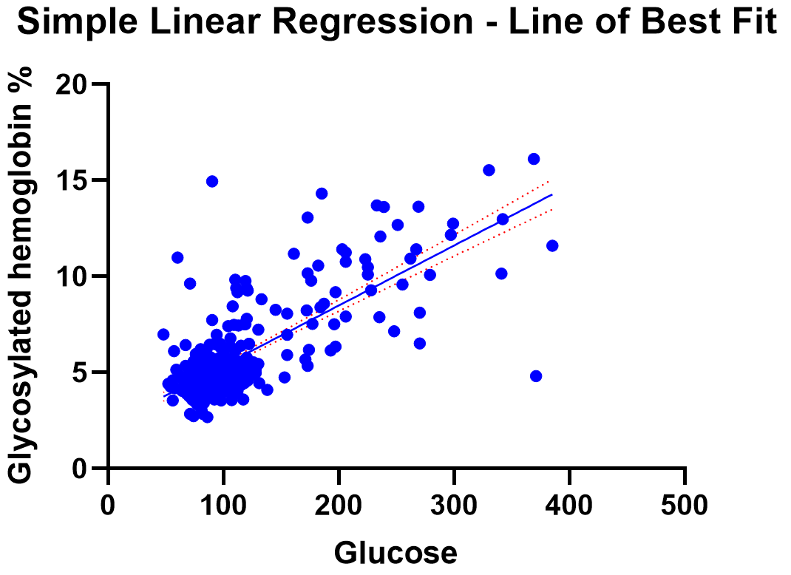

# Basic concepts:
### Classification and regression
**Classification** is a supervised learning task where the goal is to predict a category or class label for each input based on the given data. In classification, the target variable (also called the dependent variable or output) consists of discrete labels or categories.
 * Problem type: Discrete outcomes (categories or classes).
 * Target variable: Categorical (e.g., labels such as "Yes" or "No", "Cat" or "Dog", etc.).
 * Output: A class or category label (often represented as a number or text).
 * Examples of Classification:
    * Spam detection: Classifying emails as "Spam" or "Not Spam".
    * Image recognition: Identifying whether an image contains a "Cat", "Dog", or "Bird".
    * Medical diagnosis: Predicting whether a patient has a "Disease" or "No Disease" based on medical tests.
    * Credit scoring: Classifying a person as "High Risk" or "Low Risk" based on financial data.
 * Common Classification Algorithms:
    * Logistic Regression
    * Decision Trees
    * Support Vector Machines (SVM)
    * Random Forest
    * K-Nearest Neighbors (KNN)
    * Neural Networks (e.g., CNN for image classification)

**Regression** is another supervised learning task where the goal is to predict a continuous numerical value based on input data. In regression, the target variable is continuous, meaning it can take any real number within a range.
 * Problem type: Continuous outcomes (numeric values).
 * Target variable: Numerical (e.g., predicting house prices, temperature, stock prices).
 * Output: A continuous numerical value (e.g., a price, temperature, etc.).
 * Examples of Regression:
    * House price prediction: Predicting the price of a house based on features such as size, location, and the number of rooms.
    * Stock price prediction: Predicting the future price of a stock.
    * Temperature prediction: Predicting the temperature for the next day based on historical weather data.
    * Sales forecasting: Predicting future sales based on past sales data.
* Common Regression Algorithms:
    * Linear Regression
    * Decision Trees
    * Random Forest
    * Support Vector Regression (SVR)
    * Neural Networks (e.g., deep learning for regression tasks)

**Summary table**

| **Aspect**            | **Classification**                          | **Regression**                           |
|-----------------------|---------------------------------------------|------------------------------------------|
| **Target Variable**   | Categorical (discrete classes)              | Continuous (real values)                 |
| **Output**            | A class label (e.g., "Yes" or "No")         | A real number (e.g., 25.5, 300, etc.)    |
| **Example Problem**   | Spam detection, Disease diagnosis          | Price prediction, Temperature forecast   |
| **Evaluation Metrics**| Accuracy, Precision, Recall, F1-score      | Mean Absolute Error (MAE), Mean Squared Error (MSE), R-squared |
| **Output Type**       | Category (Class label)                     | Real number (numeric)                   |


### Categorial variables and numerical variables
**1. Categorical Variables (Qualitative Data)**
</br>
Categorical variables represent categories or labels. They are used to describe characteristics that can be grouped into distinct categories, where each category represents a different value. These values typically do not have a meaningful order or ranking.
 * Examples:
    * Gender: Male, Female
    * Country: USA, Canada, Germany, Japan
    * Color: Red, Blue, Green
    * Product type: Electronics, Clothing, Food
    * Marital status: Single, Married, Divorced
    * Types of Categorical Variables:
    * Nominal: Categories with no inherent order (e.g., color, country, or product type). No ranking is possible.
    * Ordinal: Categories with a meaningful order or ranking, but the distances between categories are not meaningful (e.g., education level: High School, Bachelor's, Master's, PhD; or satisfaction level: Poor, Average, Good).

**2. Numerical Variables (Quantitative Data)**
</br>
Numerical variables represent quantities and are measured in terms of numbers. They can be further divided into two types based on whether the values are discrete or continuous:

**Types of Numerical Variables:**
Discrete: These are countable values, often integers, that represent whole numbers. Discrete variables typically arise from counting something (e.g., number of children, number of products sold).
 * Examples:
    * Number of students in a class
    * Number of cars in a parking lot
    * Number of goals scored in a game

Continuous: These are values that can take any real number within a range. Continuous variables arise from measurements and can have infinite possible values between any two values.
 * Examples:
    * Height (e.g., 5.8 feet, 6.2 feet)
    * Weight (e.g., 150.5 pounds, 200.1 pounds)
    * Temperature (e.g., 32.5°C, 100.2°C)

### Fit concept
<u>In the context of the training of machine learning models</u>, the expression **"Fit"** refers to the process of training a model on a dataset. This involves the model learning the underlying patterns or relationships in the data. For instance, when you call the fit method on a machine learning model (e.g., LinearRegression, RandomForestClassifier), the model adjusts its parameters (like coefficients, weights, etc.) based on the data it is exposed to, <u>but in the context of preprocessing</u> and transformations (like scaling, normalization, or encoding), "fit" still refers to learning something from the data, but not in terms of model parameters. Instead, it means learning the necessary statistics or properties needed for the transformation. Example:
 - For scaling(with `StandardScaler`), "fit" learns the mean and standard deviation of the features in the training data.
 - For normalization (with `MinMaxScaler`), "fit" learns the minimum and maximum values of each feature.
1. Training a model
```python
from sklearn.linear_model import LinearRegression
# Example data
X_train = [[1, 2], [3, 4], [5, 6]]
y_train = [5, 7, 9]
model = LinearRegression()
model.fit(X_train, y_train)  # Fit learns the best-fit line
```
2. Preprocessing
```python
from sklearn.preprocessing import StandardScaler
data = [[1, 2], [3, 4], [5, 6]]
scaler = StandardScaler()
# Fit learns the mean and standard deviation
scaler.fit(data)
```
**Key distintions:**
- **Model fitting** (e.g., `LinearRegression.fit()`) train the data.
- **Preprocessing fitting** (e.g., `StandardScaler.fit()`) learns statistics from the
data to apply transformations.

### Transformation concept
In scikit-learn, the **transform() method** is used to apply a transformation to data using parameters that were learned previously (usually during the fit step).

**General Purpose of transform:**
The transform method modifies the input data based on the parameters learned during the fit step.

**Common use cases of transform:**
 - Scaling: In the case of feature scaling (e.g., using `StandardScaler`), transform applies the scaling formula (using the mean and standard deviation learned during fit) to the data.
 - Encoding: For categorical encoding (e.g., using `OneHotEncoder`), transform converts the input features into the encoded format based on the learned mapping.
 - Dimensionality Reduction: In algorithms like PCA (Principal Component Analysis), transform reduces the dimensions of the data using the principal components learned during fit.
```python
from sklearn.preprocessing import OneHotEncoder
# Example data
data = [[1, 'A'], [2, 'B'], [3, 'C']
encoder = OneHotEncoder()
# Fit learns the categories
encoder.fit(data)
```
```python
### Example of using transform
from sklearn.preprocessing import OneHotEncoder
from sklearn.preprocessing import StandardScaler
data = [[1, 'A'], [2, 'B'], [3, 'C']]
encoder = OneHotEncoder()
# Fit learns the categories
encoder.fit(data)
# Transform applies the one-hot encoding
encoded_data = encoder.transform(data)
```
### One-hot encoder concept
**One-hot encoding** is a technique used in machine learning to convert categorical variables into numerical variables that can be processed by machine learning algorithms. It works by creating a new binary feature for each category in the categorical variable. For example, if we have a categorical variable with three categories A, B, and C, the one-hot encoded version would be a binary vector [1, 0, 0] for category A, [0, 1, 0] for category B, and [0, 0, 1] for category C.
The dummy variable trap is a situation that occurs when using dummy variables (also known as one-hot encoding) in regression models, which leads to multicollinearity. This can cause problems when trying to interpret or train a machine learning model, particularly in linear regression models.

For example, consider a feature `Color` with three categories: Red, Blue, and Green. Using one-hot encoding, we can represent this feature with three new columns:
 * Color_Red
 * Color_Blue
 * Color_Green

The values for each row would be 1 or 0, depending on which category the data point belongs to.

**What Causes the Dummy Variable Trap?**

The dummy variable trap happens when you include all the dummy variables for a categorical feature in the regression model. This leads to perfect multicollinearity because one of the dummy variables can be perfectly predicted from the others. In other words, there is redundancy in the data.

For example, in the Color example above, if you include all three dummy variables (Color_Red, Color_Blue, and Color_Green), you don't need all of them because knowing two of the dummy variables is enough to determine the third one.

 * If `Color_Red = 1` and `Color_Blue = 0`, you know the color must be <span style="color: red; font-weight: bold;">Red</span>.
 * If `Color_Red = 0` and `Color_Blue = 1`, you know the color must be <span style="color: blue; font-weight: bold;">Blue</span>.
 * If `Color_Red = 0` and `Color_Blue = 0`, the color must be <span style="color: green; font-weight: bold;">Green</span>.

Since the third variable (Color_Green) can be inferred from the others, it's unnecessary to include it in the model.

Why is it a Problem?
When all dummy variables are included in a regression model, it introduces multicollinearity—a situation where two or more predictor variables are highly correlated. This violates the assumption of independence between the predictors, leading to:

Instability in the model: The model may produce unreliable or biased estimates for the coefficients of the features.
Inflated variance: It becomes harder to assess the significance of each predictor variable, as the effect of one predictor may be mixed with that of others.
### Lesson 4 - Linear Regression
**Linear regression** is a statistical method used for modeling the relationship between one or more independent variables (also called features or predictors) and a dependent variable (also called the target or response variable) by fitting a linear equation to observed data. It is one of the simplest and most widely used algorithms in machine learning and statistics for predictive modeling.
</br>
**Formula: F(x) = ax+b**
```python
from sklearn.linear_model import LinearRegression
import numpy as np
# Example data: Predict y based on x
X = np.array([[10], [22], [34], [46], [58]])  # Independent variable (feature)
y = np.array([1, 2, 3, 4, 5])  # Dependent variable (target)
# Create a Linear Regression model
model = LinearRegression()
# Fit the model (train it on the data)
model.fit(X, y)
# Predict using the trained model
y_pred = model.predict(X)
# Output the coefficients
print("Intercept:", model.intercept_)
print("Coefficient:", model.coef_)
# Print predictions
print("Predicted values:", y_pred)
```
**Example of linear regression graph**


### Lesson 5 - Multiple Linear Regression
**Multiple Linear Regression (MLR)** is an extension of simple linear regression that models the relationship between two or more independent variables (predictors) and a dependent variable (response). The goal of multiple linear regression is to predict the dependent variable using a linear combination of the independent variables.

The formula for Multiple Linear Regression is:
$$
Y = \beta_0 + \beta_1 X_1 + \beta_2 X_2 + \dots + \beta_n X_n + \epsilon
$$
```python
# Import necessary libraries
import numpy as np
import pandas as pd
import matplotlib.pyplot as plt
from sklearn.model_selection import train_test_split
from sklearn.linear_model import LinearRegression
from sklearn.metrics import mean_squared_error, r2_score
# Example data: House prices dataset
# Features: Number of rooms, Size (square feet)
# Target: House price in thousands of dollars
data = {
    'Rooms': [2, 3, 4, 5, 6, 7, 8, 9, 10, 11],
    'Size': [500, 600, 700, 800, 900, 1000, 1100, 1200, 1300, 1400],
    'Price': [150, 200, 250, 300, 350, 400, 450, 500, 550, 600]
}
# Convert data to DataFrame
df = pd.DataFrame(data)
# Define independent variables (X) and dependent variable (y)
X = df[['Rooms', 'Size']]  # Features
y = df['Price']  # Target
# Split data into training and testing sets
X_train, X_test, y_train, y_test = train_test_split(X, y, test_size=0.3, random_state=42)
# Initialize the Linear Regression model
model = LinearRegression()
# Train the model using training data
model.fit(X_train, y_train)
# Make predictions using the test set
y_pred = model.predict(X_test)
# Model coefficients and intercept
print("Model coefficients:", model.coef_)
print("Model intercept:", model.intercept_)
# Calculate Mean Squared Error and R-squared
mse = mean_squared_error(y_test, y_pred)
r2 = r2_score(y_test, y_pred)
print(f"Mean Squared Error (MSE): {mse}")
print(f"R-squared: {r2}")
# Plotting actual vs predicted values
plt.scatter(y_test, y_pred)
plt.xlabel('Actual Price')
plt.ylabel('Predicted Price')
plt.title('Actual vs Predicted House Prices')
plt.show()
```
### Lesson 6
**What is Backward Elimination?**

Backward elimination is a **feature selection technique** used in regression modeling to improve the model by systematically removing the least significant features (predictor variables). It’s a process to optimize the model by reducing its complexity, improving its interpretability, and sometimes enhancing its performance. The goal is to remove features that don't contribute meaningfully to predicting the dependent variable (target).

**Steps in Backward Elimination:**

1. Start with all features: You begin with all predictor variables in your model (i.e., all features are included).
2. Fit the model: You fit a regression model (such as Linear Regression) using all the features.
3. Check p-values: After fitting the model, you check the p-values of all the coefficients (parameters) associated with the features. These p-values represent the statistical significance of each feature in explaining the variability of the target variable.
4. Remove the least significant feature: If a feature has a high p-value (above a predetermined threshold), it suggests that this feature is not statistically significant in predicting the target. In this case, you remove that feature from the model.
5. Repeat the process: You fit the model again with the reduced set of features and repeat steps 3 and 4 until all remaining features have p-values lower than the threshold (usually 0.05).
6. Stop when all features are significant: The process stops when all remaining features have p-values below the significance level (threshold).

**What is a p-value?**

The p-value is a measure used in statistical hypothesis testing to determine whether a feature in a regression model is statistically significant.
 * A low p-value (typically less than 0.05) indicates that the feature is likely to be significant in explaining the target variable.
 * A high p-value suggests that the feature is not statistically significant and doesn't contribute meaningfully to the model. A common threshold for significance is 0.05, but this can vary depending on the context.